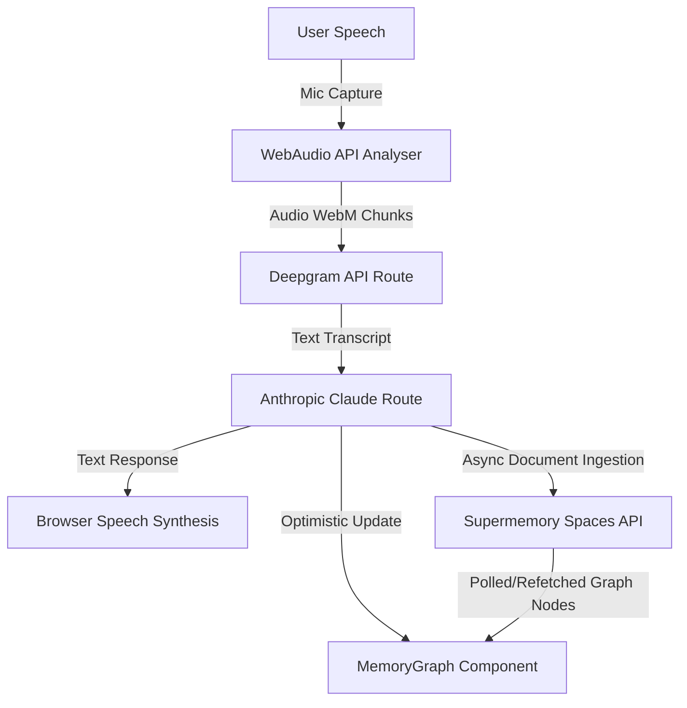

## Demo


## Memory System for Voice AI

An interactive, premium single-screen voice console that transforms spoken conversations into structured memory nodes. Powered by **Deepgram STT**, **Anthropic Claude**, and the **Supermemory Memory Graph** ecosystem.


## 🌟 Key Features

* **Voice-to-Text Transcription (Deepgram STT)**
  * Capture user vocal inputs straight from the browser microphone.
  * Sub-second transcription latency using Deepgram's Nova-2 model.
  * Real-time microphone audio amplitude/volume tracking with animated canvas ripple feedback.

* **Conversational Voice AI (Anthropic Claude)**
  * Context-aware conversational partner designed to yield short, friendly, spoken-natural responses (1–3 sentences).
  * Automatically reads assistant answers aloud using native browser Speech Synthesis.
  * **Resilient Model Fallback Pipeline**: Automatically negotiates API tier limits by checking and cascading requests across:
    1. `claude-sonnet-4-6`
    2. `claude-haiku-4-5-20251001`
    3. `claude-sonnet-4-20250514`

* **Real-time Memory Graph Engine (Supermemory API)**
  * Generates conversation snippet records and pushes them into your Supermemory workspace.
  * **Optimistic Graph Updates**: Generates and links document-to-memory nodes on the Canvas *instantly* when the assistant replies, eliminating network sync delay.
  * Fully interactive 2D Canvas graph allows dragging, zooming, panning, and hovering to highlight relationships (`derives`, `extends`, `updates`).

* **Premium Single-Screen Interface**
  * Sleek dark-mode glassmorphic dashboard designed to fit exactly on a single desktop viewport.
  * Flexible side columns scroll conversations internally, keeping workspace inputs and the core canvas static and accessible.
  * Fully responsive fallback layout for mobile devices.


## 🛠️ Architecture Workflow




## ⚙️ Environment Variables

Create a `.env.local` file in the root directory:

```env
# Supermemory Workspace Authentication API Key
SUPERMEMORY_API_KEY=your_supermemory_key

# Deepgram Speech-To-Text API Key
DEEPGRAM_KEY=your_deepgram_key

# Anthropic Claude LLM API Key
ANTHROPIC_KEY=your_anthropic_key
```


## 🚀 Getting Started

### 1. Install Dependencies
```bash
pnpm install
```

### 2. Run Development Server
```bash
pnpm run dev
```

Open [http://localhost:3000](http://localhost:3000) to launch the workspace console.

### 3. Production Build
```bash
pnpm run build
```

