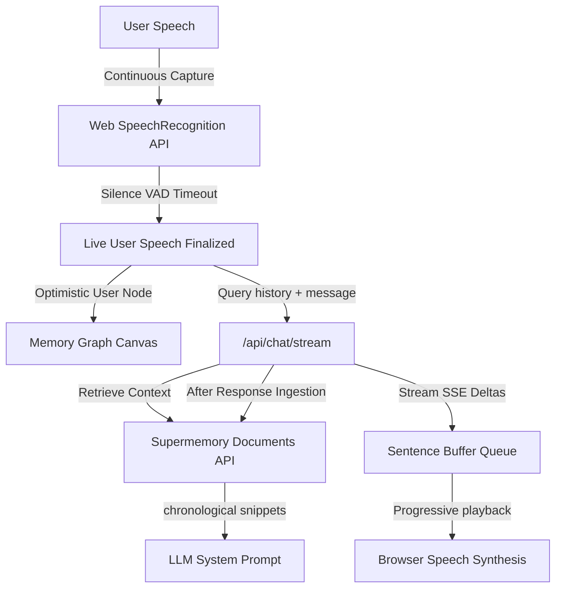

## Demo


## Memory System for Voice AI

An interactive, premium voice console that enables hands-free continuous talking, paired with real-time memory graph construction. Powered by **WebSpeech Recognition (VAD)**, **Anthropic Claude**, and the **Supermemory Memory Graph** ecosystem.


## 🌟 Key Features

* **Hands-Free Continuous Speech-To-Text (WebSpeech API)**
  - Auto-listening loop using browser-native speech recognition.
  - Custom silence-detection VAD threshold (1200ms) to automatically finalize user queries hands-free.
  - Robust auto-cooldown (2s) and connection-recovery system to bypass and heal transient network drops.

* **Queued Sentence-by-Sentence Text-To-Speech (TTS)**
  - Progressive speech generation: sentences are read aloud as soon as they complete streaming.
  - Queue-flushing barge-in support: user speaking instantly cancels previous AI speech synthesis.

* **Cross-Session Memory Persistence (Supermemory API)**
  - Automatically indexes dialogue logs into the Supermemory workspace.
  - Queries recent conversation history context from Supermemory and feeds it to the system prompt, giving the AI cross-session recall of past topics, user name (Sundaram), and summaries.

* **Real-time Memory Graph Engine**
  - **Optimistic Graph Updates**: Instantly renders document-to-memory nodes on the Canvas as the assistant streams responses, bypassing database ingestion latency.
  - Fully interactive 2D Canvas graph allows dragging, zooming, panning, and hovering to highlight relationships.

* **Premium Minimalist UI**
  - Left panel: voice-activity status indicator orb and live conversation transcript feed.
  - Right panel: full-screen interactive memory graph.


## 🛠️ Architecture Workflow




## ⚙️ Environment Variables

Create a `.env.local` file in the root directory:

```env
# Supermemory Workspace Authentication API Key (get at https://supermemory.ai)
SUPERMEMORY_API_KEY=your_supermemory_key

# Anthropic Claude LLM API Key (get at https://console.anthropic.com)
ANTHROPIC_KEY=your_anthropic_key
```


## 🚀 Getting Started

### 1. Install Dependencies
```bash
pnpm install
```

### 2. Run Development Server
```bash
pnpm run dev
```

Open [http://localhost:3000](http://localhost:3000) to launch the workspace console.

### 3. Production Build
```bash
pnpm run build
```
